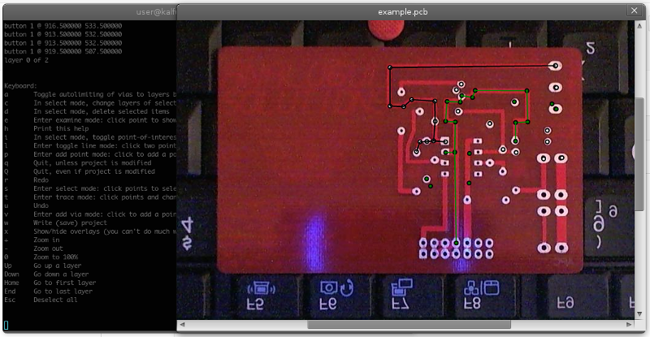

Requires ``gtk+-2.0`` and ``goocanvas``

    apt-get install libgtk2.0-dev libgoocanvas-dev

Install:

    git clone https://github.com/unixdj/depcb.git
    cd depcb
    make

Run:

    ./depcb save.pcb layer1.jpg layer2.jpg ...

Example:

    cd example; ../depcb example.pcb

Pressing ``h`` in window will print a list of shortcut keys.

by http://www.vygo.net/vadik/
